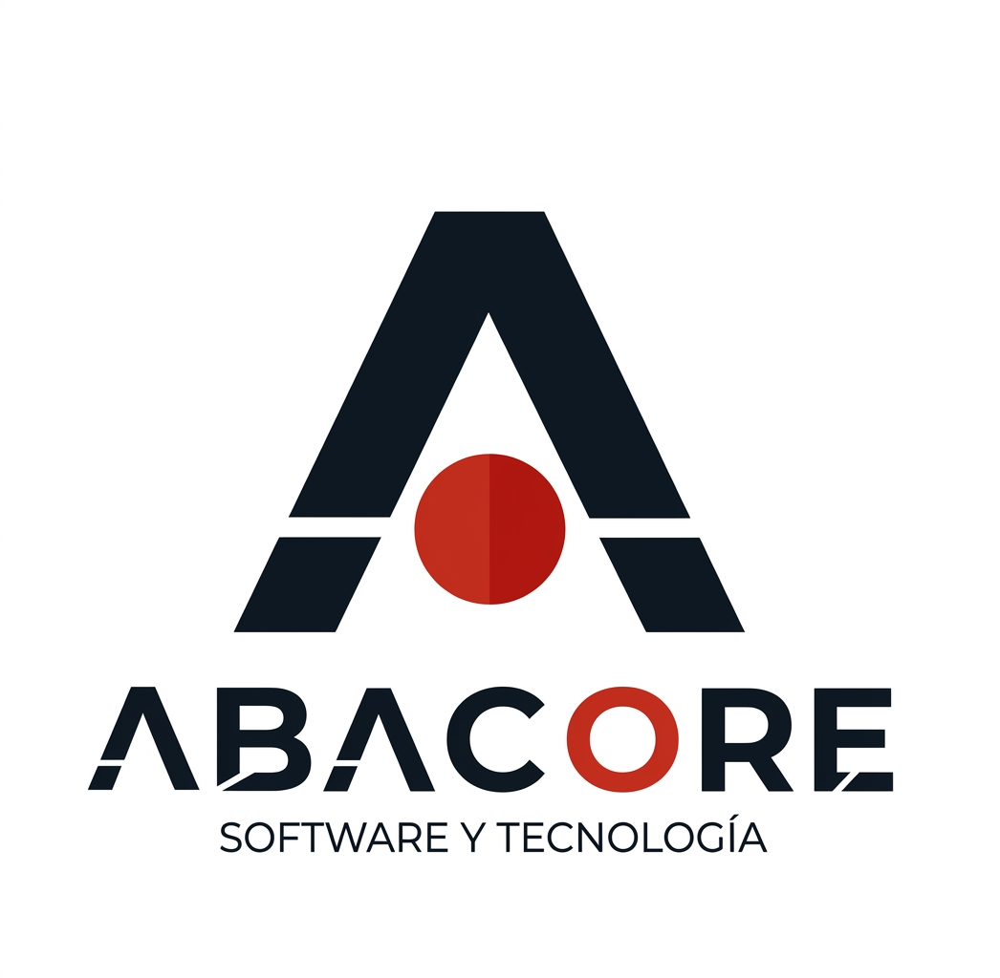

<div align="center">
  
  <h1>ABACORE S.A.S.</h1>
  <p><em>Firma de ingeniería tecnológica dedicada a la arquitectura de sistemas y al desarrollo de software escalable.</em></p>
</div>

---

## 🎯 Nuestra Visión

> *"Democratizar el acceso a la transformación digital, demostrando que desde el Meta se puede construir ingeniería de software altamente escalable y de nivel global para resolver los problemas reales de la industria local."*

---

## 🚀 Sobre el Proyecto

Este repositorio contiene el código fuente de la Landing Page oficial corporativa de **ABACORE S.A.S.** Diseñada bajo estrictos estándares de calidad, la plataforma web refleja nuestra identidad corporativa: tecnológica, innovadora, segura y cercana.

La arquitectura de la aplicación ha sido construida garantizando alta escalabilidad, rendimiento optimizado y un código modular ultra-limpio, omitiendo intencionalmente frameworks pesados para demostrar dominio absoluto sobre las bases de la ingeniería web.

## 🛠️ Tecnologías y Arquitectura

El proyecto emplea una arquitectura modular combinando el poder del desarrollo nativo en el frontend con un micro-backend robusto en Node.js.

*   **Frontend (Vanilla Web):**
    *   **HTML5 Semántico:** Estructura optimizada para accesibilidad y motores de búsqueda (SEO).
    *   **CSS3 (Modular):** Sistema de diseño basado en variables o tokens (`variables.css`). Estilos divididos por componentes para alta mantenibilidad y consistencia visual.
    *   **JavaScript (ES Modules):** Lógica dinámica segmentada (`app.js`, `api.js`, `ui.js`, `navbar.js`) aprovechando peticiones asíncronas e inyección dinámica del DOM.
*   **Backend & Integraciones API:**
    *   **Node.js:** Micro-servidor HTTP puro para gestionar de manera segura peticiones locales, evitar exponer claves secretas al cliente y configurar políticas CORS.
    *   **GitHub REST API:** Integración de red para visualizar repositorios destacados del portafolio de forma automática.
    *   **Resend API:** Sistema backend integrado para el procesamiento seguro de formularios de contacto y despliegue de respuestas automáticas bidireccionales por correo.

## 📁 Estructura del Proyecto

```text
ABACORE S.A.S/
├── assets/img/        # Recursos gráficos y multimedia
├── css/               # Hojas de estilo modulares (variables, base, UI)
├── js/                # Módulos JavaScript (Controladores y lógica de UI/API)
├── index.html         # Documento estructurado principal
├── server.js          # Micro-Servidor Backend (Node.js)
├── .env               # Variables de entorno (API Keys - Ignorado en Git)
└── package.json       # Manifiesto del proyecto y dependencias de NPM
```

## ⚙️ Entorno de Desarrollo Local

Para levantar el entorno de desarrollo en tu máquina local:

1. Clona este repositorio:
   ```bash
   git clone https://github.com/Joan-Mora/Abacore-S.A.S.git
   ```
2. Navega al directorio e instala las dependencias del backend:
   ```bash
   cd "Abacore-S.A.S"
   npm install
   ```
3. Crea un archivo `.env` en la raíz del proyecto y añade tu API Key:
   ```env
   EMAIL_API=tu_api_key_de_resend
   ```
4. Inicia el servidor de desarrollo:
   ```bash
   npm run dev
   ```
5. Accede desde tu navegador en `http://localhost:3000`.

---

## CEO

<table>
  <tr>
    <td align="center">
      <br />
      <sub><b>Darwin Joan Aveiga Mora</b></sub><br />
      <a href="https://github.com/Joan-Mora">@Joan-Mora</a><br />
      <sub>Desarrollador Full Stack</sub>
    </td>
  </tr>
</table>
